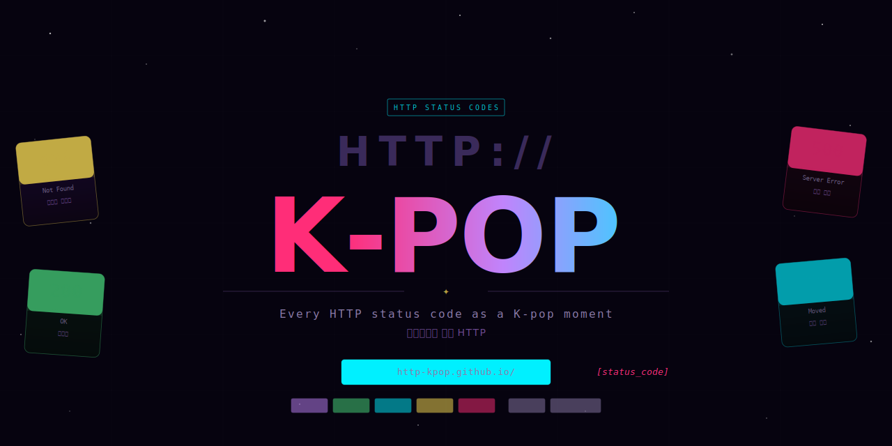

Hey everyone — This is a Idol-As-A-Service (IAAS) where every HTTP status code represents a KPOP moment.

## Usage 

```
http-kpop.github.io/[status_code].png
```

---

Made by [@r4shsec](https://github.com/r4shsec) 💝 | Licensed under [MIT](https://github.com/http-kpop/http-kpop.github.io/blob/main/LICENSE)

